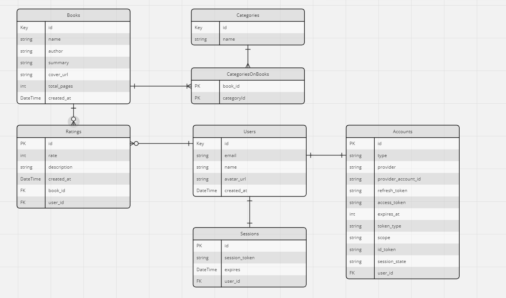

## Estrutura do Banco de Dados

  

Abaixo está a estrutura do banco de dados com detalhes de cada tabela:

1. ### Tabela `users`:

   - **Função**: Armazena informações dos usuários do sistema.
   - **Colunas**:
     - `id`: Identificador único para cada usuário, usado como chave primária.
     - `email`: Endereço de e-mail do usuário, deve ser único e é utilizado para contato ou identificação.
     - `name`: Nome do usuário.
     - `avatar_url`: URL para o avatar (imagem de perfil) do usuário.
     - `created_at`: Data e hora em que o usuário foi criado no sistema, com um valor padrão definido para o momento em que o registro é inserido no banco.

2. ### Tabela `books`:

   - **Função**: Contém informações sobre os livros.
   - **Colunas**:
     - `id`: Identificador único para cada livro, serve como chave primária.
     - `name`: Nome do livro.
     - `author`: Autor do livro.
     - `summary`: Resumo ou descrição do livro.
     - `cover_url`: URL para a imagem da capa do livro.
     - `total_pages`: Número total de páginas do livro.
     - `created_at`: Data e hora em que o registro do livro foi criado no sistema.

3. ### Tabela `categories`:

   - **Função**: Lista as categorias que podem ser associadas aos livros.
   - **Colunas**:
     - `id`: Identificador único para cada categoria, usado como chave primária.
     - `name`: Nome da categoria.

4. ### Tabela `CategoriesOnBooks`:

   - **Função**: Estabelece a relação muitos-para-muitos entre livros e categorias.
   - **Colunas**:
     - `book_id`: Chave estrangeira que referencia o `id` de um livro na tabela `books`.
     - `categoryId`: Chave estrangeira que referencia o `id` de uma categoria na tabela `categories`.
     - **Chave Primária Composta**: A combinação de `book_id` e `categoryId` serve como chave primária para garantir que a mesma categoria não seja atribuída mais de uma vez ao mesmo livro.

5. ### Tabela `ratings`:

   - **Função**: Armazena avaliações feitas pelos usuários para os livros.
   - **Colunas**:
     - `id`: Identificador único para cada avaliação, utilizado como chave primária.
     - `rate`: Nota ou pontuação dada ao livro.
     - `description`: Descrição ou comentário sobre a avaliação.
     - `created_at`: Data e hora em que a avaliação foi criada.
     - `book_id`: Chave estrangeira que referencia o `id` de um livro na tabela `books`.
     - `user_id`: Chave estrangeira que referencia o `id` de um usuário na tabela `users`.

6. ### Tabela `accounts`:

   - **Função**: Gerencia as contas dos usuários, incluindo informações de autenticação de terceiros.
   - **Colunas**:
     - `id`: Identificador único para cada conta, usado como chave primária.
     - `user_id`: Chave estrangeira que referencia o `id` de um usuário na tabela `users`.
     - `type`: Tipo de conta ou serviço (por exemplo, 'local', 'Google', 'Facebook').
     - `provider`: Provedor do serviço de autenticação.
     - `provider_account_id`: Identificador da conta fornecido pelo serviço de autenticação.
     - `refresh_token`: Token utilizado para atualizar o `access_token` quando necessário.
     - `access_token`: Token utilizado para acessar a conta do usuário.
     - `expires_at`: Timestamp de quando o `access_token` expira.
     - `token_type`: Tipo do token (por exemplo, 'Bearer').
     - `scope`: Escopo dos privilégios do token.
     - `id_token`: Token de identidade fornecido pelo provedor de autenticação.
     - `session_state`: Estado da sessão do usuário.

7. ### Tabela `sessions`:
   - **Função**: Armazena as sessões dos usuários para gerenciar o login e a autenticação.
   - **Colunas**:
     - `id`: Identificador único para cada sessão, usado como chave primária.
     - `session_token`: Token associado à sessão do usuário.
     - `user_id`: Chave estrangeira que referencia o `id` de um usuário na tabela `users`.
     - `expires`: Data e hora em que a sessão expira.
